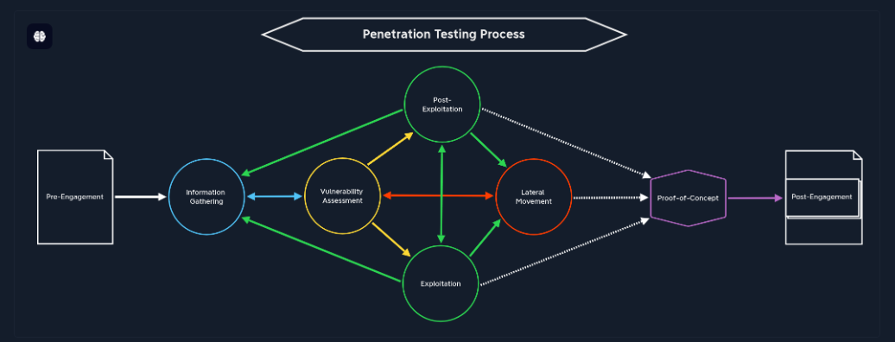

# Penetration Testing Process

> A penetration testing process is defined by successive steps and events performed by the penetration tester to find a path to the predefined objective.

### Penetration Testing Stages

<figure><figcaption></figcaption></figure>

| **Stage**                     | **Description**                                                                                                                                                                                                                                                                            |
| ----------------------------- | ------------------------------------------------------------------------------------------------------------------------------------------------------------------------------------------------------------------------------------------------------------------------------------------ |
| `1. Pre-Engagement`           | The first step is to create all the necessary documents in the pre-engagement phase, discuss the assessment objectives, and clarify any questions.                                                                                                                                         |
| `2. Information Gathering`    | Once the pre-engagement activities are complete, we investigate the company's existing website we have been assigned to assess. We identify the technologies in use and learn how the web application functions.                                                                           |
| `3. Vulnerability Assessment` | With this information, we can look for known vulnerabilities and investigate questionable features that may allow for unintended actions.                                                                                                                                                  |
| `4. Exploitation`             | Once we have found potential vulnerabilities, we prepare our exploit code, tools, and environment and test the webserver for these potential vulnerabilities.                                                                                                                              |
| `5. Post-Exploitation`        | Once we have successfully exploited the target, we jump into information gathering and examine the webserver from the inside. If we find sensitive information during this stage, we try to escalate our privileges (depending on the system and configurations).                          |
| `6. Lateral Movement`         | If other servers and hosts in the internal network are in scope, we then try to move through the network and access other hosts and servers using the information we have gathered.                                                                                                        |
| `7. Proof-of-Concept`         | We create a proof-of-concept that proves that these vulnerabilities exist and potentially even automate the individual steps that trigger these vulnerabilities.                                                                                                                           |
| `8. Post-Engagement`          | Finally, the documentation is completed and presented to our client as a formal report deliverable. Afterward, we may hold a report walkthrough meeting to clarify anything about our testing or results and provide any needed support to personnel tasked with remediating our findings. |

### Pre-engangement

The entire pre-engagement process consists of three essential components:

1. Scoping questionnaire
2. Pre-engagement meeting
3. Kick-off meeting

This stage also requires the preparation of several documents before a penetration test can be conducted that must be signed by our client and us so that the declaration of consent can also be presented in written form if required. Otherwise the penetration test could breach the [Computer Misuse Act](https://www.legislation.gov.uk/ukpga/1990/18/contents). These documents include, but are not limited to:

| **Document**                                                         | **Timing for Creation**                             |
| -------------------------------------------------------------------- | --------------------------------------------------- |
| `1. Non-Disclosure Agreement` (`NDA`)                                | `After` Initial Contact                             |
| `2. Scoping Questionnaire`                                           | `Before` the Pre-Engagement Meeting                 |
| `3. Scoping Document`                                                | `During` the Pre-Engagement Meeting                 |
| `4. Penetration Testing Proposal` (`Contract/Scope of Work` (`SoW`)) | `During` the Pre-engagement Meeting                 |
| `5. Rules of Engagement` (`RoE`)                                     | `Before` the Kick-Off Meeting                       |
| `6. Contractors Agreement` (Physical Assessments)                    | `Before` the Kick-Off Meeting                       |
| `7. Reports`                                                         | `During` and `after` the conducted Penetration Test |

### Scoping Questionnaire

After initial contact is made with the client, we typically send them a `Scoping Questionnaire` to better understand the services they are seeking. This scoping questionnaire should clearly explain our services and may typically ask them to choose one or more from the following list:

|                                     |                                       |
| ----------------------------------- | ------------------------------------- |
| ☐ Internal Vulnerability Assessment | ☐ External Vulnerability Assessment   |
| ☐ Internal Penetration Test         | ☐ External Penetration Test           |
| ☐ Wireless Security Assessment      | ☐ Application Security Assessment     |
| ☐ Physical Security Assessment      | ☐ Social Engineering Assessment       |
| ☐ Red Team Assessment               | ☐ Web Application Security Assessment |

Aside from the assessment type, client name, address, and key personnel contact information, some other critical pieces of information include:

